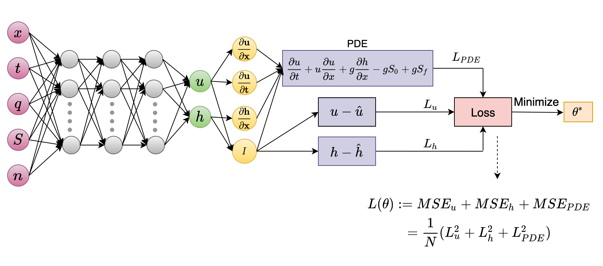

# Physics-Informed-Neural-Network-for-Flood-Forecasting

### Process outline for generating synthetic data.
![Process outline for generating synthetic data.] (Visualization/dataset_process_outline.png)

### Schematic representation of Physics Informed Neural Networks (PINNs) for solving Saint Venant Equation.

