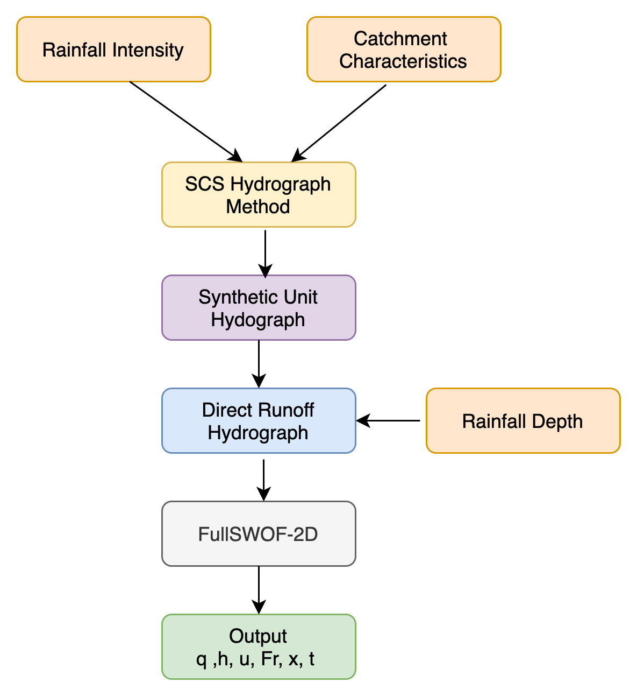

# Physics Informed Neural Network (PINN) for Flood Forecasting

Implementation notebooks of the paper, Mahesh, Ragini Bal, Jorge Leandro, and Qing Lin. "Physics Informed Neural Network for Spatial-Temporal Flood Forecasting." Climate Change and Water Security. Springer, Singapore, 2022. 77-91., https://link.springer.com/chapter/10.1007/978-981-16-5501-2_7

xxxxxxxxxxxxxxxxxxxxxxxxxxxxxxxxxxxxxxxxxxxxxxxxxxxxxxxxxxxxxxxxxxxxxxxxxxxxxxxxxxxxx

### Process outline for generating synthetic data.

The synthetic datasets generation process starts with  generating hydrographs which required to run the FullSWOF-2D to obtain the final outputs. The SCS Hydrograph method is applied as a first step where it takes catchment characteristics and rainfall intensities as input and generates Synthetic Unit Hydrographs. The rainfall intensities considered here ranges from 1 to 6 minutes at an interval of 1 minute each. Therefore creating 6 different unit period hydrographs. These Synthetic Unit Hydrographs are transformed into Direct Runoff Hydrographs by multiplying it with rainfall depth as a next step. 

The rainfall depth ranges from 1 to 8 cm at an interval of 1 cm each. This transformation is done on a selective basis where it provides the desired peak discharge in the range of 2 to 18 m3/s. The peak discharges are classified as low (2-5 m3/s), medium (6-14 m3/s), and high peaks (15-18 m3/s). The interpolated hydrographs along with different slopes and mannings friction coefficient are introduced as an input in FullSWOF-2D to generate different flood scenarios.

### Schematic representation of Physics Informed Neural Networks (PINNs) for solving Saint Venant Equation.

